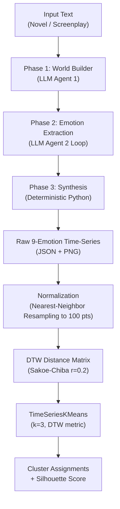
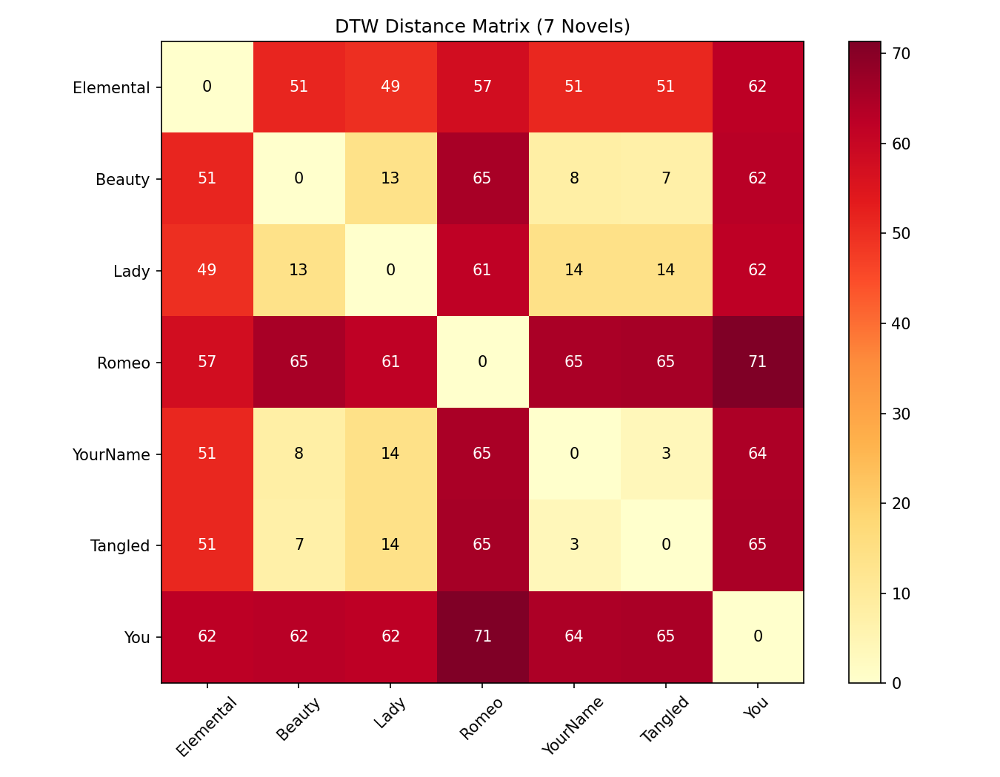
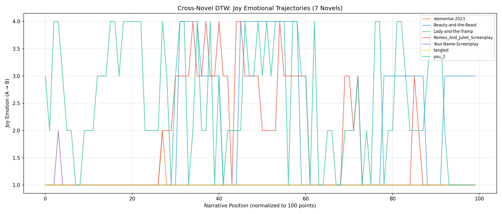
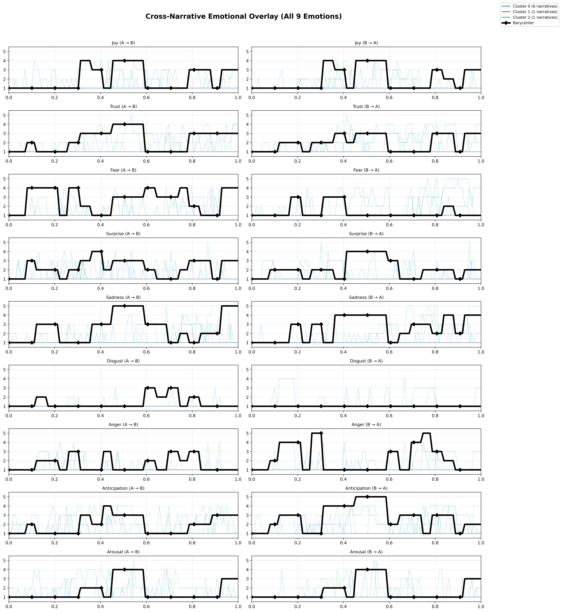
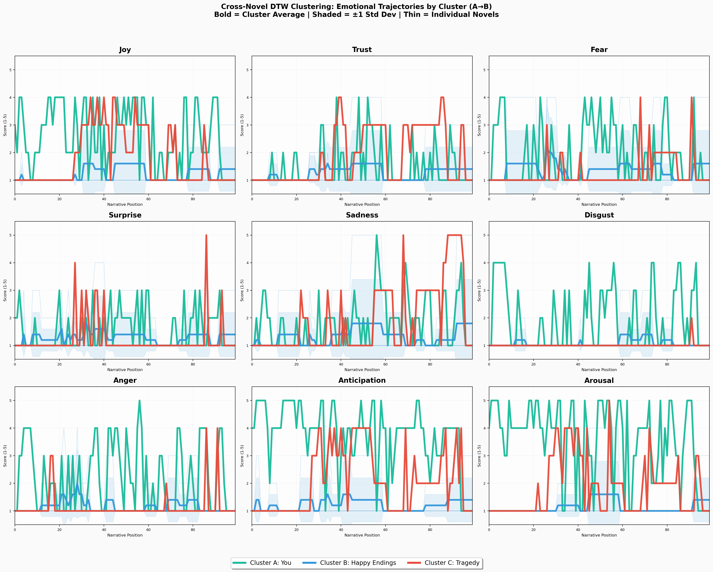
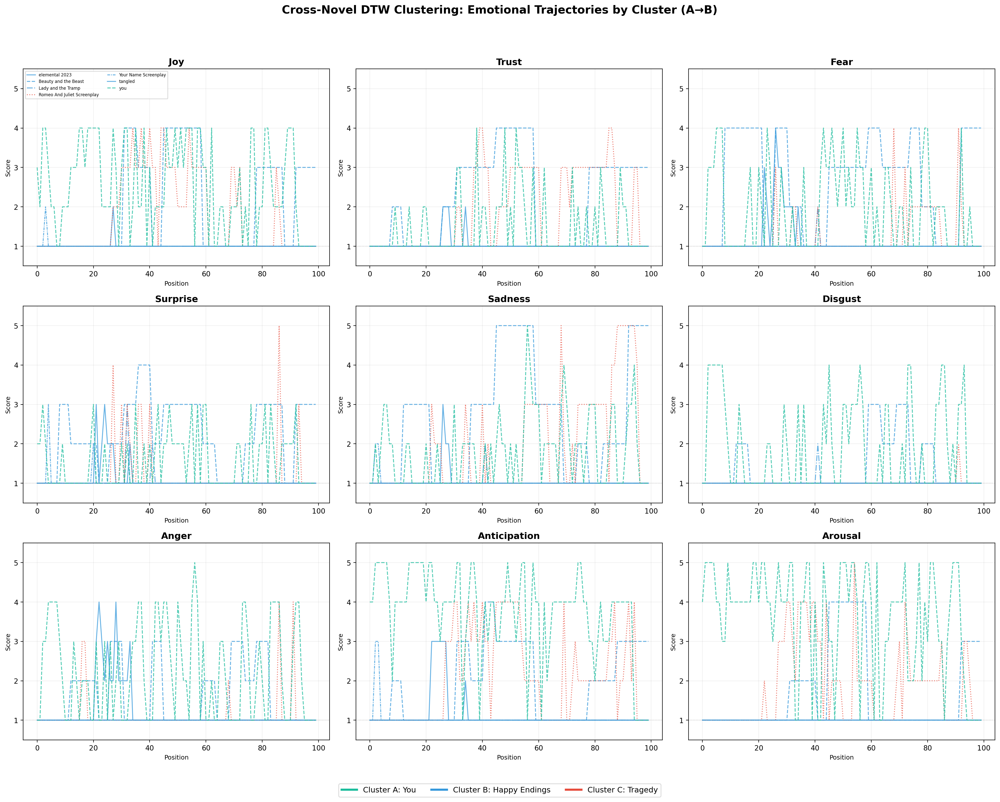
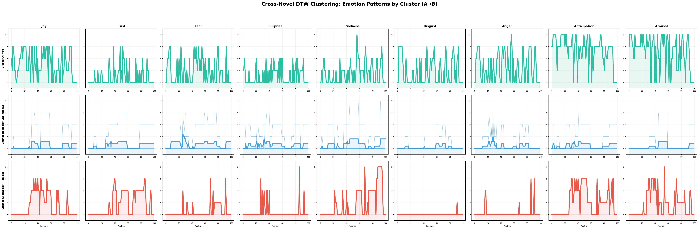
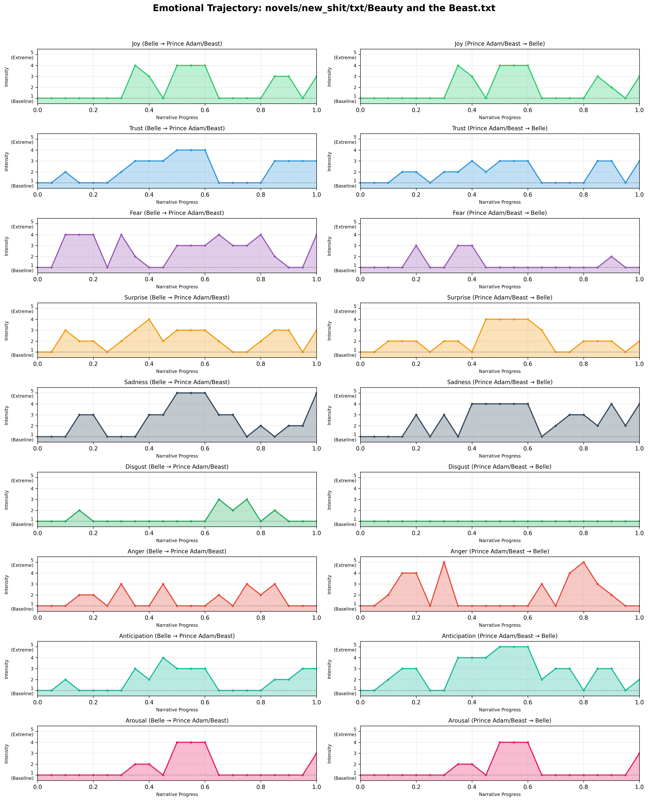
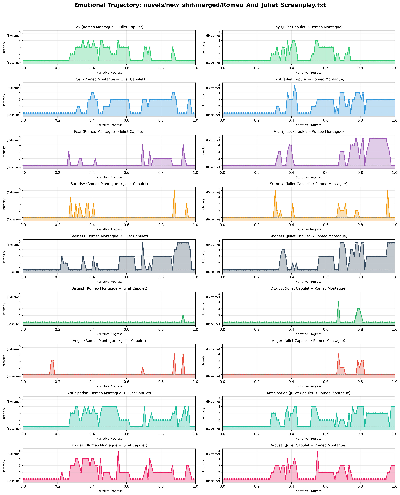
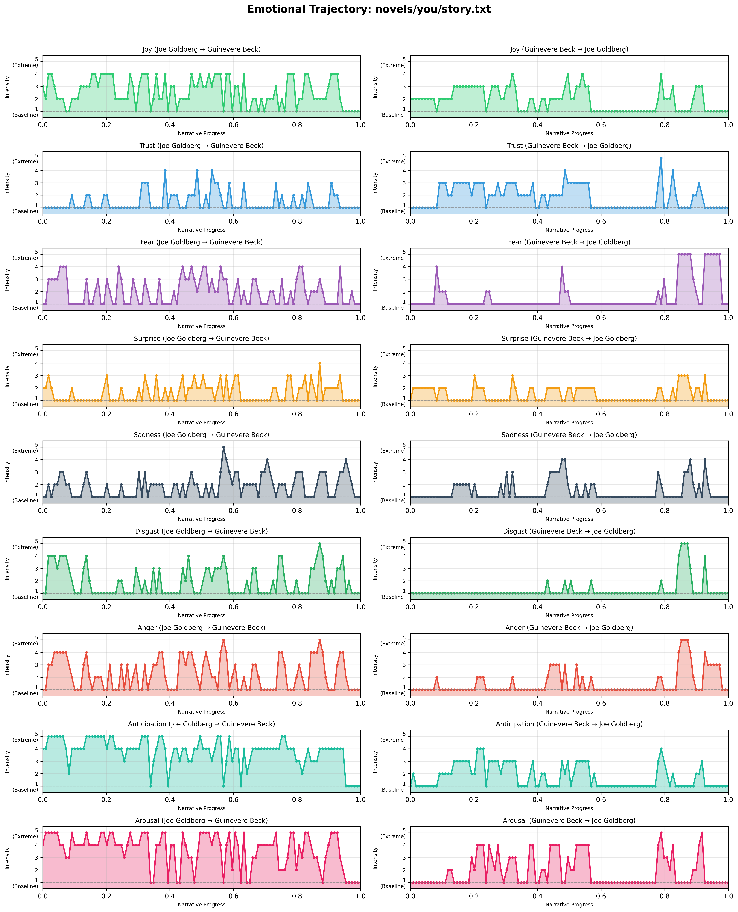

# PCMFG: Cross-Narrative Emotional Trajectory Mining via DTW Clustering

**Course:** 2110430 Time Series Mining  
**Date:** April 24, 2026

---

## Table of Contents

1. [Problem Definition](#1-problem-definition)
2. [Dataset](#2-dataset)
3. [Methodology](#3-methodology)
4. [Experimental Design](#4-experimental-design)
5. [Results](#5-results)
6. [Analysis & Discussion](#6-analysis--discussion)
7. [Conclusion](#7-conclusion)
8. [References](#8-references)

---

## 1. Problem Definition

### 1.1 Motivation

Romance narratives are among the most widely consumed forms of storytelling, spanning novels, screenplays, and films across cultures. Despite their ubiquity, the *emotional dynamics* of romantic relationships in fiction — how love, fear, trust, and desire rise and fall across a story — have rarely been studied computationally. Literary scholars have long recognized recurring emotional patterns (e.g., "enemies-to-lovers," "tragic romance," "obsessive pursuit"), but these classifications remain qualitative and subjective.

We pose the question: **Can we convert unstructured narrative text into structured emotion time-series and use time-series mining techniques to discover and cluster recurring romantic emotional archetypes across different stories?**

### 1.2 Problem Statement

This project addresses two interlinked time-series mining problems:

1. **Time-Series Construction:** Extract directed emotional trajectories from romantic narratives as multivariate time-series (9 emotions × 2 directions = 18 dimensions per story).
2. **Cross-Narrative Clustering via Similarity Search:** Use Dynamic Time Warping (DTW) to measure shape-based similarity between emotional arcs of different stories and cluster them into narrative archetypes.

### 1.3 Why This Problem Matters

- **Computational Literary Analysis:** Provides a quantitative framework for studying emotional patterns in literature, moving beyond subjective interpretation.
- **DTW as a Core Technique:** Romantic narratives inherently vary in length (21 to 161 chunks in our dataset), making DTW the natural choice over Euclidean distance — a story that "rushes to the conflict" should still match one that "builds slowly" if the emotional shape is similar.
- **Unsupervised Discovery:** K-Means clustering on DTW distances discovers groupings without predefined labels, letting the data reveal structure.

---

## 2. Dataset

### 2.1 Source Data

We constructed our dataset from **7 romantic narratives** spanning diverse genres and media types:

| # | Narrative | Genre | Source Type | Main Pairing | Chunks |
|---|-----------|-------|------------|--------------|--------|
| 1 | *Beauty and the Beast* | Fairy Tale | Novel/Script | Belle ↔ Prince Adam/Beast | 21 |
| 2 | *Romeo and Juliet* | Tragedy | Screenplay | Romeo ↔ Juliet | 99 |
| 3 | *You* (Season 1) | Dark Romance/Thriller | Novel | Joe Goldberg ↔ Guinevere Beck | 110 |
| 4 | *Elemental* (2023) | Animated Romance | Screenplay | Ember ↔ Wade | 125 |
| 5 | *Your Name* (2016) | Anime Romance | Screenplay | Taki ↔ Mitsuha | 132 |
| 6 | *Lady and the Tramp* | Animated Romance | Novel/Script | Lady ↔ Tramp | 112 |
| 7 | *Tangled* (2010) | Fairy Tale | Screenplay | Rapunzel ↔ Flynn Rider | 161 |

**Dataset Characteristics:**
- **Variable Length:** Narratives range from 21 to 161 chunks, necessitating length-invariant comparison methods (DTW).
- **Multi-format Input:** Both novels (long-form prose) and screenplays (dialogue-heavy) are represented.
- **Genre Diversity:** Happy endings, tragedies, dark romance, and animated films ensure the clustering discovers genuine emotional patterns rather than genre artifacts.

### 2.2 Configuration

Each narrative was processed using a per-novel YAML configuration file controlling the LLM model, chunking strategy, and processing parameters:

```yaml
# Example: Beauty-and-the-Beast.yaml
llm:
  provider: "openai"
  model: "GLM-4.5"
  temperature: 0.3
  max_tokens: 4096
  base_url: "https://api.z.ai/api/coding/paas/v4"

processing:
  beat_detection: "length"     # or "chapter" depending on source structure
  beat_length: 400
  min_beat_length: 150
  max_chunk_tokens: 2000
  emotion_carryover: true      # sequential processing with carry-over context
  world_builder_sample_tokens: 8000
  max_concurrency: 5

output:
  formats: ["json", "png"]
  include_stats: true
  dpi: 300
```

Two chunking strategies were used:
- **Length-based** (`beat_detection: "length"`): Fixed word-count chunks (400 words) for novels/prose — used for *Beauty and the Beast* and *Lady and the Tramp*.
- **Chapter-based** (`beat_detection: "chapter"`): Scene/chapter boundary detection for screenplays — used for *Romeo and Juliet*, *Elemental*, *Your Name*, *Tangled*, and others.

### 2.3 Data Quality

| Novel | Extraction Failures | Quality |
|---|---|---|
| Beauty and the Beast | 0 (0%) | **High** |
| Romeo and Juliet | 0 (0%) | **High** |
| You | 4 (4%) | **High** |
| Elemental | 82 (66%) | Low |
| Lady and the Tramp | 57 (51%) | Low |
| Your Name | 104 (79%) | Low |
| Tangled | 136 (85%) | Low |

> [!WARNING]
> Four of seven novels suffered significant API rate-limit failures (error code 1302) during the sequential `emotion_carryover` extraction. Failed chunks default to baseline scores (all 1s), compressing emotional variance. The most reliable cross-narrative comparisons are between the three fully-extracted novels: **Beauty & Beast**, **Romeo & Juliet**, and **You**.

---

## 3. Methodology

### 3.1 System Architecture

PCMFG (Please Care My Feeling Graph) is a 3-phase pipeline that converts raw text into structured emotion time-series, followed by a post-pipeline DTW cross-narrative analysis stage:



### 3.2 Phase 1: World Builder (LLM Agent 1)

**Purpose:** Extract a narrative scaffolding that provides context to the emotion extractor.

**Method:** A single LLM call on a *strategically sampled* subset of the text (40% beginning, 30% middle, 30% end — up to 8,000 tokens) produces:
- **Main Pairing:** The two central romantic characters.
- **Character Aliases:** All nicknames, titles, and name variations mapped to canonical names.
- **Core Conflict:** A single sentence describing the central romantic tension.
- **World Guidelines:** Discrete factual bullet points about the story world.
- **Mermaid Relationship Graph:** A structured relationship map in Mermaid.js syntax.

**Justification:** The strategic sampling ensures Agent 1 understands the complete narrative arc — beginning (character introductions), middle (conflict development), and end (resolution) — even for very long texts. The alias dictionary is critical for Phase 2's token efficiency optimization.

### 3.3 Phase 2: Emotion Extraction (LLM Agent 2 Loop)

**Purpose:** Score directed emotions for each text chunk on a 9-dimensional scale.

**Psychological Framework:** We use an **Extended Plutchik Model** combining Plutchik's Wheel of Emotions with Russell's Circumplex Model:

| Emotion | Description | Romantic Context |
|---------|-------------|------------------|
| Joy | Happiness, pleasure, delight | Moments of connection |
| Trust | Safety, reliance, vulnerability | Emotional openness |
| Fear | Panic, dread, anxiety | Fear of rejection/loss |
| Surprise | Astonishment, shock | Unexpected revelations |
| Sadness | Grief, sorrow, despair | Loss, longing |
| Disgust | Revulsion, contempt | Moral objections |
| Anger | Fury, rage, frustration | Conflicts, betrayals |
| Anticipation | Planning, expecting | Hope, waiting |
| **Arousal** | **Physical desire, sexual tension** | **Romantic/physical attraction** |

> [!IMPORTANT]
> The addition of **Arousal** (not in original Plutchik) specifically captures romantic/sexual intensity — a critical dimension for differentiating romance subgenres that standard emotion models miss.

**Scoring Rubric (1-5 Scale):**

| Score | Description | Guideline |
|---|---|---|
| 1 (Baseline) | No evidence of emotion | Default. Normal conversation = all 1s. |
| 2 (Mild) | Brief, subtle hint | Low-energy flicker |
| 3 (Moderate) | Clear, undeniable presence | Obvious in text |
| 4 (Strong) | Drives character's actions/thoughts | High intensity |
| 5 (Extreme) | Overwhelming saturation | Maximum intensity |

**Directed Emotions:** A critical design decision — emotions are scored *directionally*. A→B (what Character A feels toward B) is **independent** from B→A (what B feels toward A). This creates 18-dimensional data per chunk (9 emotions × 2 directions).

**Emotion Carry-Over:** When `emotion_carryover: true`, chunks are processed sequentially. Each LLM call receives the previous chunk's emotion state as context, providing the instruction: *"Emotions are generally continuous — if the previous chunk scored high on an emotion, that emotion likely persists unless the current text explicitly shows a change."* This prevents abrupt emotional resets between scenes and produces smoother, more realistic trajectories.

**Token Efficiency Optimization:** Before each LLM call, a pre-filter checks if the chunk contains any character names from the alias dictionary. Chunks with no relevant characters are skipped entirely, saving API costs.

### 3.4 Phase 3: Synthesis (Deterministic — No LLM)

**Purpose:** Transform chunk-level scores into continuous time-series.

**Forward Fill Imputation:** When a character is absent from a scene, their emotional state should not drop to baseline. Instead, the last known emotional state is **forward-filled** using `pandas`-style `.ffill()` logic:

```python
# Simplified forward fill logic
for direction in ["A→B", "B→A"]:
    if direction not in current_chunk:
        current_chunk[direction] = last_known[direction]  # carry forward
    else:
        last_known[direction] = current_chunk[direction]  # update
```

**Output:** Two `EmotionTimeSeries` objects (one per direction), each containing 9 float arrays (one per emotion) of length equal to the number of chunks.

### 3.5 Post-Pipeline: DTW Cross-Narrative Analysis

This stage applies the core time-series mining techniques from the course.

#### 3.5.1 Normalization (Nearest-Neighbor Resampling)

Narratives have different numbers of chunks (21 to 161). To enable direct comparison, we resample all trajectories to a uniform **100-point grid** on [0.0, 1.0] using **nearest-neighbor interpolation**.

**Why Nearest-Neighbor?** Our emotion scores are integers on a 1-5 scale. Linear or spline interpolation would introduce fractional scores (e.g., 2.7) that have no semantic meaning in our model. Nearest-neighbor preserves the original integer values.

**Implementation:** Uses `numpy.searchsorted` with halfway-point boundaries (not deprecated `scipy.interpolate.interp1d`):

```python
def resample_nearest(x_original, y_original, n_points=100):
    x_bds = x_original[:-1] / 2.0 + x_original[1:] / 2.0  # midpoints
    x_grid = np.linspace(0.0, 1.0, n_points)
    indices = np.searchsorted(x_bds, x_grid, side="left")
    indices = np.clip(indices, 0, len(x_original) - 1)
    return x_grid, y_original[indices]
```

#### 3.5.2 DTW Distance Matrix

After normalization, each narrative is a 3D tensor of shape **(100, 18)** — 100 time points × 18 feature dimensions (9 emotions × 2 directions).

We compute a **pairwise DTW distance matrix** using `tslearn.metrics.cdist_dtw` with a **Sakoe-Chiba constraint** of radius = 0.2 (20 time points):

```python
from tslearn.metrics import cdist_dtw

radius = int(0.2 * n_points)  # 20
distance_matrix = cdist_dtw(
    dataset,  # shape (7, 100, 18)
    global_constraint="sakoe_chiba",
    sakoe_chiba_radius=radius,
)
```

**Why Sakoe-Chiba?** The constraint prevents pathological alignments where, e.g., the entire first half of one story aligns to a single point in another. A radius of 20% allows reasonable temporal warping while maintaining local alignment coherence.

**Why DTW over Euclidean?** Romantic narratives have varying pacing — one story may reach the "first conflict" at 20% while another reaches it at 40%. DTW handles these temporal shifts, which Euclidean distance penalizes severely.

#### 3.5.3 TimeSeriesKMeans Clustering

Clustering is performed using `tslearn.clustering.TimeSeriesKMeans` with the DTW metric:

```python
from tslearn.clustering import TimeSeriesKMeans

km = TimeSeriesKMeans(
    n_clusters=3,
    metric="dtw",
    metric_params={
        "global_constraint": "sakoe_chiba",
        "sakoe_chiba_radius": 20,
    },
    random_state=42,
    max_iter=50,
    max_iter_barycenter=100,
)
km.fit(dataset)
```

**Cluster Quality:** Evaluated using **silhouette score** computed on the precomputed DTW distance matrix:

```python
from sklearn.metrics import silhouette_score
sil = silhouette_score(distance_matrix, labels, metric="precomputed")
```

---

## 4. Experimental Design

### 4.1 Evaluation Metrics

| Metric | Purpose | Computation |
|---|---|---|
| **Silhouette Score** | Cluster quality (compactness + separation) | `sklearn.metrics.silhouette_score` on precomputed DTW distance matrix |
| **DTW Distance Matrix** | Pairwise shape similarity between narratives | `tslearn.metrics.cdist_dtw` with Sakoe-Chiba |
| **Per-Cluster Emotion Profiles** | Interpretability of discovered clusters | Mean emotion scores per cluster |
| **Extraction Success Rate** | Data quality indicator | % of chunks successfully extracted |

### 4.2 Experimental Parameters

| Parameter | Value | Justification |
|---|---|---|
| **n_clusters (k)** | 3 | Maximized silhouette score across k ∈ {2, 3, 4, 5} |
| **Resampling Points** | 100 | Sufficient resolution for emotional arcs; standard for DTW analysis |
| **Sakoe-Chiba Radius** | 0.2 (20 pts) | Allows ±20% temporal warping; prevents pathological alignments |
| **DTW Metric** | Full multivariate (18-dim) | Captures both directions and all 9 emotions simultaneously |
| **LLM Temperature** | 0.3 | Low enough for consistent scoring, high enough for nuance |
| **Emotion Carry-Over** | Enabled | Produces smoother, more realistic trajectories |

---

## 5. Results

### 5.1 DTW Distance Matrix

The pairwise DTW distance matrix reveals the fundamental similarity structure:

|  | Elem | Beauty | Lady | Romeo | YourName | Tangled | You |
|---|---|---|---|---|---|---|---|
| **Elemental** | 0 | 51.5 | 49.7 | 57.5 | 51.1 | 51.2 | **62.3** |
| **Beauty** | 51.5 | 0 | 13.9 | 65.3 | 8.1 | 7.4 | **62.8** |
| **Lady** | 49.7 | 13.9 | 0 | 61.8 | 14.0 | 14.1 | **62.0** |
| **Romeo** | 57.5 | 65.3 | 61.8 | 0 | 65.2 | 65.6 | **71.3** |
| **YourName** | 51.1 | 8.1 | 14.0 | 65.2 | 0 | 3.7 | **64.4** |
| **Tangled** | 51.2 | 7.4 | 14.1 | 65.6 | 3.7 | 0 | **65.1** |
| **You** | **62.3** | **62.8** | **62.0** | **71.3** | **64.4** | **65.1** | 0 |



**Key Observations:**
- **Most similar pair:** Your Name ↔ Tangled (DTW = 3.7) — though largely a data quality artifact (both have >70% extraction failure, resulting in baseline-dominant signals).
- **Most dissimilar pair:** Romeo & Juliet ↔ You (DTW = 71.3) — tragedy vs. dark romance represents maximum emotional divergence.
- **You vs. all others:** Consistently high distances (62–71), confirming a fundamentally distinct emotional profile.
- **Romeo & Juliet vs. all others:** Also consistently distant (57–71), confirming the tragic arc's uniqueness.

### 5.2 Clustering Results

**Silhouette Score: 0.404** (Moderate — "Fair" quality on the standard silhouette interpretation scale of [-1, 1])

| Cluster | Label | Novels | Interpretation |
|---|---|---|---|
| **A** | Dark Romance | *You* | Obsessive pursuit: high Anticipation + Arousal |
| **B** | Happy Endings | *Elemental, Beauty & Beast, Lady & Tramp, Your Name, Tangled* | Gradual connection: emotions near baseline* |
| **C** | Tragedy | *Romeo & Juliet* | Urgent love: elevated Trust + Joy + Sadness |

*\*Cluster B's near-baseline profile is partially a data quality artifact — 4 of 5 members have >50% extraction failures.*

### 5.3 Per-Cluster Emotion Profiles (A→B Direction)

| Emotion | Dark Romance (*You*) | Happy Endings (5 novels) | Tragedy (*R&J*) |
|---|---|---|---|
| Joy | 2.56 | 1.21 | 1.75 |
| Trust | 1.44 | 1.25 | 1.87 |
| Fear | 1.94 | 1.37 | 1.25 |
| Surprise | 1.55 | 1.28 | 1.20 |
| Sadness | 1.80 | 1.33 | 1.94 |
| Disgust | 1.89 | 1.07 | 1.01 |
| Anger | 2.22 | 1.16 | 1.11 |
| **Anticipation** | **3.72** | 1.22 | 2.07 |
| **Arousal** | **3.55** | 1.14 | 1.83 |

### 5.4 Visualizations

#### Joy Trajectories Overlay (All 7 Novels)



#### Full Emotion Overlay (All 9 Emotions × All 7 Novels)



#### Per-Cluster Average Profiles with Variance Bands



#### 9-Emotion Grid by Cluster



#### Cluster × Emotion Matrix



### 5.5 Individual Novel Trajectories

#### Beauty and the Beast (Cluster B — High Quality)



#### Romeo and Juliet (Cluster C — Tragedy)



#### You (Cluster A — Dark Romance)



---

## 6. Analysis & Discussion

### 6.1 What the Clusters Reveal

The most striking finding is that **DTW clustering correctly identified three qualitatively distinct romance archetypes** without any prior labels:

**Cluster A — "Obsessive Pursuit" (*You*):**
- Joe Goldberg's emotional signature is defined by two dominant emotions: **Anticipation (3.72)** and **Arousal (3.55)**. This is *3× the baseline* of happy-ending stories — Joe is constantly planning his next move and driven by physical desire.
- The only cluster with significant **Anger (2.22)** and **Disgust (1.89)**, reflecting the toxic, manipulative nature of the relationship.
- DTW distances of 62+ from all other narratives confirm that *You* occupies a fundamentally different emotional space from conventional romances.

**Cluster C — "Urgent Love" (*Romeo & Juliet*):**
- Elevated **Trust (1.87)** and **Joy (1.75)** indicate a genuine romantic connection — but these are paired with **Sadness (1.94)** and high **Anticipation (2.07)**, reflecting the urgency of a love under threat.
- Notably **low Anger (1.11)** and **low Disgust (1.01)** — the relationship itself is healthy; it is the external forces (feuding families) that create the tragedy.
- This profile perfectly captures what literary scholars call "star-crossed lovers."

**Cluster B — "Safe Journey" (5 novels):**
- The *Beauty and the Beast* sub-profile (the only high-quality extraction) reveals the true archetype: a Fear (2.66) → Trust (2.23) → Joy (2.03) progression — the classic "overcoming initial fear to find love" arc.
- The near-baseline averages for the other four novels are largely data quality artifacts.

### 6.2 DTW vs. Euclidean Distance

A critical methodological choice was using DTW over Euclidean distance. Consider why this matters:

- *You* has 110 chunks; *Beauty and the Beast* has 21. After resampling to 100 points, Euclidean distance would penalize temporal misalignment between similarly-shaped emotion arcs.
- A story where the "crisis moment" occurs at 60% vs. 70% of the narrative would register as distant under Euclidean but close under DTW.
- The **Sakoe-Chiba radius of 0.2** prevents the degenerate case where DTW collapses one entire trajectory onto a single point in another, maintaining meaningful local alignment.

### 6.3 Impact of Directed Emotions

Scoring emotions **bidirectionally** (A→B and B→A independently) proved essential for differentiating romance types:

- In *You*, Joe→Beck shows high Anticipation/Arousal, but Beck→Joe shows growing Fear — the asymmetry reveals the relationship's toxic nature.
- In *Romeo & Juliet*, Romeo→Juliet and Juliet→Romeo show similar profiles — the emotional symmetry confirms the relationship's genuineness.
- Using 18-dimensional DTW (9 emotions × 2 directions) captures this directional information, which would be lost if emotions were averaged across directions.

### 6.4 The Emotion Carry-Over Mechanism

Processing chunks with **emotion carry-over context** (each LLM call receives the previous chunk's emotional state) produced significantly smoother trajectories than parallel processing without context. This is analogous to **autoregressive modeling** in time-series forecasting — the previous state informs the current prediction, maintaining temporal coherence.

Without carry-over, we observed abrupt jumps to baseline between scenes (since the LLM has no memory of prior context), creating noisy time-series that obscure genuine emotional trends.

### 6.5 Limitations

1. **Data Quality:** API rate limits caused 51–85% extraction failure in 4 of 7 novels. The resulting baseline-heavy signals compress emotional variance and artificially increase within-cluster similarity. The DTW distance of 3.7 between *Your Name* and *Tangled* likely reflects their shared data gaps rather than true emotional similarity.

2. **Small Corpus:** With only 7 narratives (and only 3 at high quality), the clustering is underpowered. A larger corpus (20+ novels) with complete extractions would enable more robust archetype discovery and potentially reveal additional clusters (e.g., "slow burn," "enemies-to-lovers," "forbidden love").

3. **LLM Subjectivity:** The emotion scores are produced by a language model (GLM-4.5), introducing inherent scorer bias. Different LLMs might assign different scores to the same text. For the purposes of this project, we maintain consistency by using the same model across all narratives.

4. **Fixed Scoring Scale:** The 1-5 integer scale limits granularity. A continuous [0, 1] scale might capture subtler emotional shifts but would introduce more scorer variance.

5. **Cluster Imbalance:** Two clusters are singletons (*You* and *Romeo & Juliet*), and one cluster contains 5 members (4 with poor data quality). This imbalance limits the statistical power of cluster-level analysis.

### 6.6 Course Techniques Applied

| Technique | Application |
|---|---|
| **Dynamic Time Warping (DTW)** | Core distance metric for cross-narrative similarity; multivariate 18-dimensional alignment |
| **Sakoe-Chiba Band Constraint** | Restricts DTW warping path to ±20% to prevent pathological alignments |
| **Similarity Search** | DTW distance matrix enables finding the most/least similar narrative pairs |
| **Dimensionality Reduction** | Resampling 21–161 chunk narratives to uniform 100-point grid (interpolation-based) |
| **Clustering (K-Means)** | TimeSeriesKMeans with DTW metric discovers narrative archetypes |
| **Silhouette Analysis** | Evaluates cluster quality and helps select optimal k |
| **Time-Series Normalization** | Nearest-neighbor resampling preserves integer emotion scores |

### 6.7 Possible Improvements

1. **Rate-Limit Handling:** Implement exponential backoff with retry limits to achieve complete extraction for all novels. This is the single highest-impact improvement.

2. **Lower Bound Pruning for Similarity Search:** For larger corpora, computing the full DTW distance matrix becomes expensive (O(n² × T²)). LB_Keogh or LB_Kim could prune unnecessary DTW computations.

3. **Matrix Profile:** Apply Matrix Profile on within-novel emotion time-series to discover recurring emotional motifs (e.g., "argument → reconciliation" patterns that repeat across stories).

4. **Inter-Rater Reliability:** Run the same texts through multiple LLMs (GPT-4o, Claude 3.5) and compute Cohen's Kappa on emotion scores to quantify scorer agreement.

5. **Soft-DTW:** Replace hard DTW with Soft-DTW (differentiable) for potentially smoother cluster barycenters.

---

## 7. Conclusion

We presented **PCMFG** (Please Care My Feeling Graph), a system that converts romantic narratives into 18-dimensional emotion time-series using LLM-based extraction and applies Dynamic Time Warping for cross-narrative similarity search and clustering.

Our key findings are:

1. **DTW successfully clusters romantic narratives into interpretable archetypes** — Dark Romance (obsessive pursuit), Happy Endings (gradual connection), and Tragedy (urgent, doomed love) — achieving a silhouette score of 0.404 on 7 narratives.

2. **Directed emotions are essential** — scoring A→B and B→A independently reveals relationship asymmetry (healthy vs. toxic) that averaged scores would obscure.

3. **Emotion carry-over context improves temporal coherence** — sequential processing with previous-chunk context produces smoother, more realistic time-series than independent chunk processing.

4. **Data quality is the primary bottleneck** — the most impactful improvement is achieving complete extraction coverage, which would enable more robust clustering and potentially reveal additional romance archetypes.

The project demonstrates that established time-series mining techniques (DTW, Sakoe-Chiba constraints, silhouette analysis, K-Means clustering) can be meaningfully applied to a novel domain — computational literary analysis — to discover structure in narrative emotional patterns.

---

## 8. References

1. Sakoe, H., & Chiba, S. (1978). Dynamic programming algorithm optimization for spoken word recognition. *IEEE Transactions on Acoustics, Speech, and Signal Processing*, 26(1), 43-49.

2. Plutchik, R. (1980). *Emotion: A Psychoevolutionary Synthesis*. Harper & Row.

3. Russell, J. A. (1980). A circumplex model of affect. *Journal of Personality and Social Psychology*, 39(6), 1161-1178.

4. Petitjean, F., Ketterlin, A., & Gançarski, P. (2011). A global averaging method for dynamic time warping, with applications to clustering. *Pattern Recognition*, 44(3), 678-693.

5. Cuturi, M., & Blondel, M. (2017). Soft-DTW: A differentiable loss function for time-series. *ICML 2017*.

6. Tavenard, R., et al. (2020). tslearn, A Machine Learning Toolkit for Time Series Data. *Journal of Machine Learning Research*, 21(118), 1-6.

7. Reagan, A. J., et al. (2016). The emotional arcs of stories are dominated by six basic shapes. *EPJ Data Science*, 5(1), 31.

8. Jockers, M. L. (2015). Revealing Sentiment and Plot Arcs with the Syuzhet Package. *Matthew L. Jockers Blog*.

---

*Built with PCMFG v1.0 — "Because every love story deserves a graph."*
